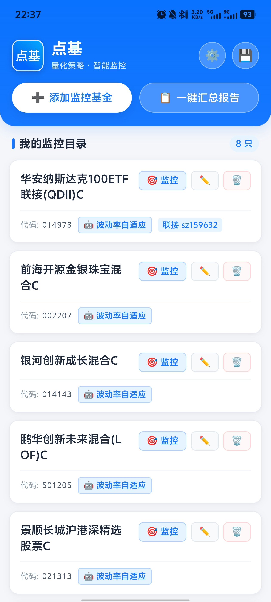
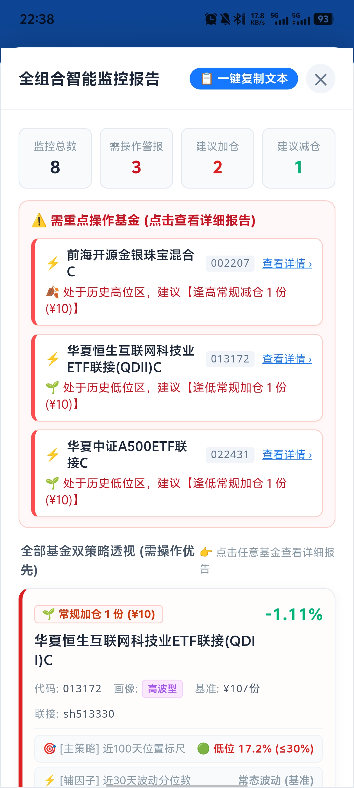
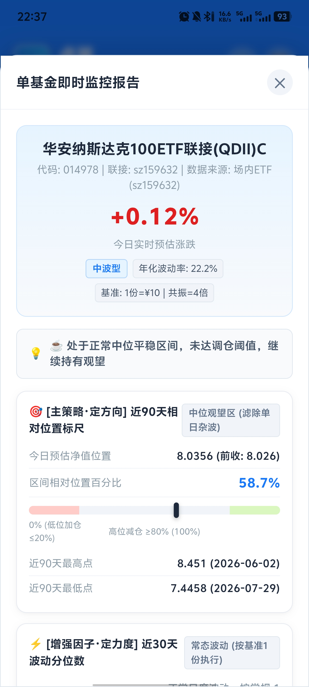
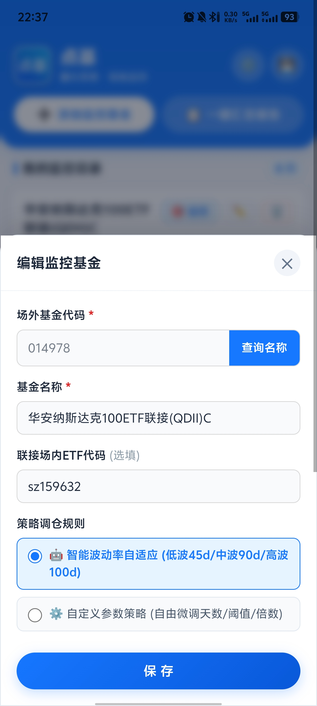
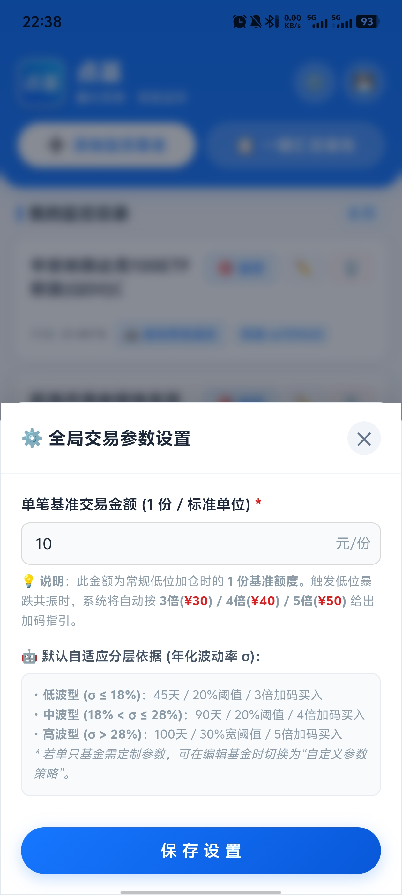
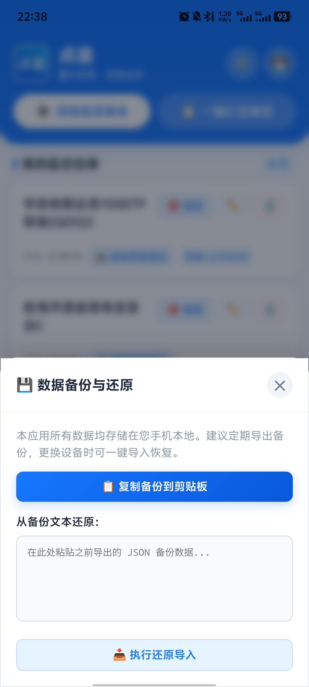

# 📈 点基 (DianJi) - 基金智能策略监控 App

> **极简、现代、注重隐私的个人量化基金监控应用**  
> **100% 纯手机端独立单机运行 · 零服务器依赖 · 支付宝清爽金融科技主题 · “位置定方向，波动定力度”自适应量化决策系统**

[](LICENSE)
[](https://developer.android.com/)
[]()
[]()

---

## 🌟 为什么开发「点基」？

很多个人投资者希望用科学量化规则管理基金定投（如区间分位、相对高低点、加减仓时机），但在实际操作中常常遇到以下困扰：
1. **传统无脑定投痛点**：无论牛熊盲目扣款，震荡市频繁磨损，牛市高位买入过多筹码，熊市过早耗尽子弹导致爆仓或深套。
2. **服务器搭建门槛高**：需要自己租用云服务器、配置 Python 环境、维护数据库与反向代理。
3. **财务隐私担忧**：不希望将自己的真实持仓与自选基金数据上传给不受控的第三方商业云端。
4. **出门使用受限**：离开电脑或特定局域网 WiFi 就无法随时查看监控。

**「点基」彻底打破了传统的“客户端 + 云端服务器”架构**：
将全部公开网络行情获取、年化波动率自适应计算、双层量化决策引擎与本地数据库，**100% 移植至 Android 手机本地极速运行**。打开即用，随时随地随身查阅，零维护成本，完全掌控个人隐私。

---

## 📱 App 实机演示截图

| 监控主页与持仓目录 | 全组合可视化汇总体检 |
| :---: | :---: |
|  |  |
| **单基金深度量化评估** | **极简添加与代码智能核实** |
|  |  |
| **全局交易参数与自适应分层** | **本地数据无损备份与还原** |
|  |  |

---

## 🏆 策略实测：自适应量化策略 vs 普通定投

在过去一年的小样本实盘与历史回测测试中，本应用采用的**自适应波动率 + 高低位共振策略**相比于传统普通无脑定投展现出显著优势：
* **平均收益率显著提升**：平均收益率达 **16.59%**（较普通定投的 11.26% 提升了近一半，相对增幅达 **+47.29%**）；
* **实际到手利润更多**：总到手净利润提升了 **+43.56%**；
* **本金占用大幅降低 35.5%**：平均最大持仓本金占用减少了 **35.5%**。在留存更充裕流动性、从容防爆仓的前提下，实现了更高的资金使用效率。

> 💡 **核心逻辑在于**：中位震荡坚决不追涨、不盲目扣款摊薄子弹；在历史低位遭遇恐慌暴跌时动态多倍重注加仓拉低均价；在估值高位极值加速时分批止盈锁定到手利润。

---

## 🚀 核心功能特性

### 1. 📱 真正的零服务器架构 (Zero-Server)
* **原生网络直连**：基于 Capacitor 原生网络底层，手机端直接请求天天基金与腾讯行情公开接口，**无跨域限制、无中间服务器中转**。
* **极速本地存储**：自选基金与自定义参数存储在手机本地 `localStorage`，读写耗时 $<1\text{ms}$，财务持仓数据永不上传云端。
* **秒开体验**：无开屏广告，无需注册账号或输入密码，打开 App 0.1 秒直达监控看板。

### 2. ⚡ “位置定方向，波动定力度” 双层量化决策系统

#### 🤖 默认波动率自适应分层体系 (基于真实年化波动率 $\sigma$)
系统自动提取单只基金近 135 个交易日（约半年）历史净值走势计算客观年化波动率，自动匹配最优周期与阈值：
* **低波型 ($\sigma \le 18\%$)**：回溯 45天 / 20% 高低位阈值 / 触发暴跌共振时 **3倍加码** 买入（如货币/纯债/红利低波类）；
* **中波型 ($18\% < \sigma \le 28\%$)**：回溯 90天 / 20% 高低位阈值 / 触发暴跌共振时 **4倍加码** 买入（如宽基沪深300/消费/医药等）；
* **高波型 ($\sigma > 28\%$)**：回溯 100天 / 30% 宽阈值 / 触发暴跌共振时 **5倍加码** 买入（如纳指、半导体、光伏、科创等高波品种）。

#### ⚙️ 支持单基金自由自定义参数
除了默认自适应策略外，用户在添加/编辑单只基金时，可一键切换为「自定义参数策略」，自由微调：
* 回溯历史天数（如 30~365 天）
* 高低位判定阈值百分比（如 10%~35%）
* 恐慌共振时的加减码倍数（如 2~10 倍）
* 该基金专属单笔基准金额（支持独立设置，或继承全局）

#### 🎯 决策机制拆解
* 🎯 **【主策略 · 定方向（做不做）】区间相对位置标尺**：
  $$PosRatio = \frac{NAV_{est} - NAV_{min}}{NAV_{max} - NAV_{min}} \times 100\%$$
  * **$PosRatio \le 阈值$**：进入**历史低位区**，取得买入准入资格；
  * **$PosRatio \ge (100\% - 阈值)$**：进入**历史高位区**，取得卖出准入资格；
  * **中位区间**：坚决**持有观望**，杜绝频繁换手磨损。

* ⚡ **【增强因子 · 定力度（做多少）】近 30 天大幅波动分位数**：
  * 计算近 30 日日涨跌幅分布的 90% 超涨分位与 10% 超跌分位；
  * 低位遇恐慌暴跌 ➔ **🔥 强力加仓 (3~5倍金额)**；低位微跌 ➔ **🌱 常规加仓 (1倍基准)**；
  * 高位遇加速超涨 ➔ **🚨 强力减仓 (3~5倍金额)**；高位震荡 ➔ **🍂 常规减仓 (1倍基准)**。

| 主策略：区间标尺 (定方向) | 辅因子：30天波动分位 (定力度) | 最终决策指令 | 仓位管理建议 |
| :--- | :--- | :--- | :--- |
| **低位区** | **触发恐慌超跌 (击穿10%分位)** | 🔥 **【强力加仓】** | 双重共振最佳加码点，系统按设置倍数(3~5倍)指引金额 |
| **低位区** | 未触发超跌 (常态/小跌) | 🌱 **【常规加仓】** | 处于估值洼地，按标准 1 份基准额度逢低定投 |
| **高位区** | **触发加速超涨 (突破90%分位)** | 🚨 **【强力减仓】** | 狂热共振止盈点，大幅减仓锁定到手收益 |
| **高位区** | 未触发超涨 (高位平稳) | 🍂 **【常规减仓】** | 处于估值高位，分批小幅落袋为安 |
| **中位区** | 无论日内涨跌多剧烈 | ☕ **【持有观望】** | **自动过滤单日杂波**，坚决不追涨杀跌 |

---

### 3. 💾 本地数据安全备份与还原
* 支持将全部监控自选一键导出为轻量 JSON 文本；
* 更换手机设备时，直接粘贴导入即可 0.1 秒完全恢复。

---

## 📥 安装与下载

您可以在 GitHub 的 [Releases 页面](../../releases) 获取编译好的最新安装包：

* 📱 **最新发布包**：前往 [GitHub Releases](../../releases/latest) 下载 `点基.apk`
* 📌 **兼容名称**：`基金智能监控_单机版.apk`
* 📱 **系统兼容**：Android 7.0 及以上所有主流手机与平板设备。无需 Root，安装即可直接运行。

---

## 🛠️ 本地编译构建指南

```bash
# 1. 克隆代码库
git clone https://github.com/MarkR630/fund_monitor_app_android.git
cd fund_monitor_app_android

# 2. 安装项目依赖
npm install

# 3. 将前端资源同步至 Android 原生工程
npx cap copy

# 4. 执行 Gradle 编译构建
cd android
./gradlew assembleDebug
# Windows PowerShell:
# .\gradlew.bat assembleDebug
```
编译成功后的 APK 安装包位于 `android/app/build/outputs/apk/debug/app-debug.apk`。

---

## ⚠️ 免责声明 (Disclaimer)

1. 本项目仅供个人量化投资策略研究、数据可视化探索与移动端技术交流使用，**不构成任何投资建议、买卖要约或收益保证**。
2. 行情数据来源于互联网公开接口，预估净值可能受网络波动、交易时差等因素影响，最终净值以基金公司官方公布数据为准。
3. 证券市场有风险，投资决策需独立思考、审慎评估，风险自负。

---

## 📄 开源许可证

本项目遵循 [MIT License](LICENSE) 开源协议。欢迎提交 Issue、PR 或 Fork 共同改进！
