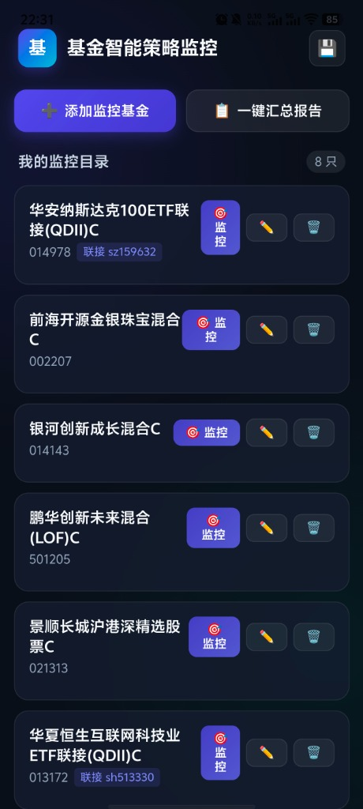
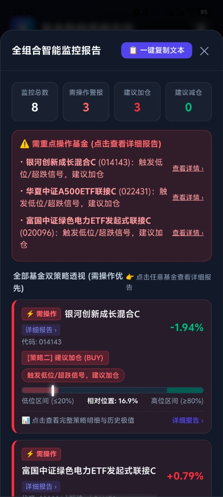
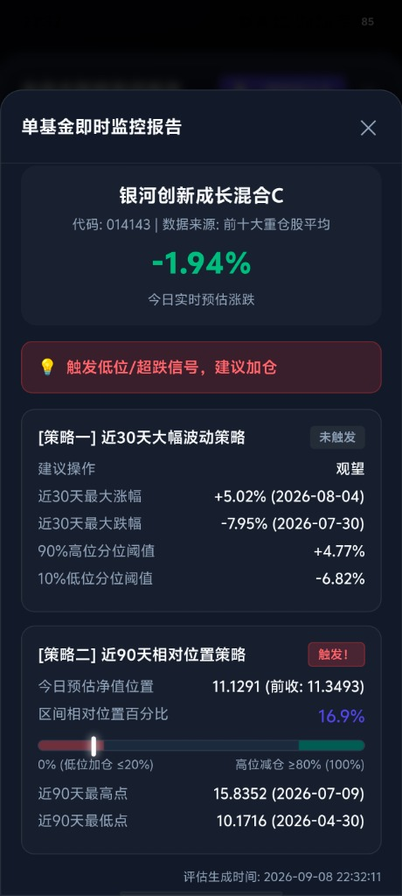
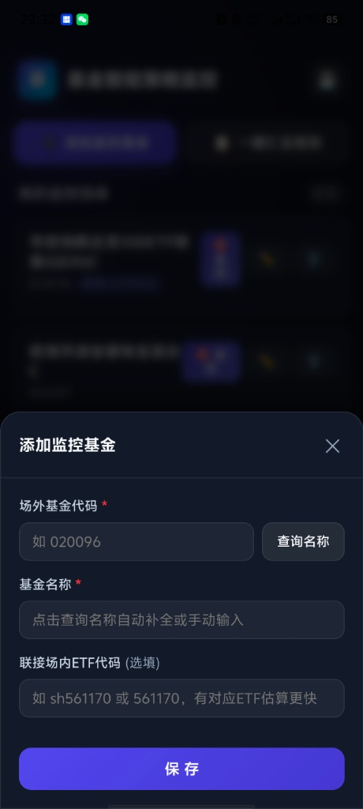

# 📈 基金智能策略监控 (Fund Monitor Standalone)

> **极简、现代、注重隐私的个人量化基金监控 App**  
> **100% 纯手机端独立运行 · 零服务器依赖 · 双量化调仓策略 · 汇总报告可视化**

[](LICENSE)
[](https://developer.android.com/)
[]()
[]()

---

## 🌟 为什么开发这个项目？

很多个人投资者希望使用量化规则监控自选基金（如均线分位、相对高低点、加减仓提醒），但面临以下痛点：
1. **服务器负担重**：需要自己租用云服务器、配置 Python 环境、维护数据库与局域网 IP。
2. **隐私担忧**：不希望将自己的真实持仓与自选基金上传到第三方不受控的服务器。
3. **出门不便**：离开电脑或特定局域网 WiFi，就无法实时查看监控。

**本项目彻底颠覆了传统的“客户端 + 服务器”架构**：
将所有的网络行情请求、双策略量化数学计算与数据持久化，**全部移植到手机本地运行**。打开 App 即用，随身携带，零维护成本。

---

## 📱 App 实机演示截图

| 监控主页与持仓目录 | 全组合可视化汇总体检 |
| :---: | :---: |
|  |  |
| **单基金深度量化评估** | **极简添加与代码智能联想** |
|  |  |

---

## 🚀 核心功能特性

### 1. 📱 真正的零服务器架构 (Zero-Server)
* **原生网络直连**：基于 Capacitor 原生网络底层，手机直连天天基金与腾讯行情公开接口，**无跨域限制、无中间服务器代理**。
* **极速本地存储**：自选基金与自定义参数直接保存在手机本地 `localStorage`，读写耗时 $<1\text{ms}$，数据永不上传云端，彻底保护财务隐私。
* **免登录秒开**：无需注册账号和输入密码，打开 App 0.1 秒直达监控主页。

### 2. ⚡ 双量化调仓策略 (Dual Strategy Engine)
移植自经典量化模型，手机本地毫秒级执行双策略评估：
* **[策略一] 近 30 天大幅波动分位数策略**：
  * 本地解析近 30 个交易日历史收益率，动态计算 90% 上涨分位数（超涨）与 10% 下跌分位数（超跌）；
  * 当日预估涨幅超过 90% 极值触发 **建议减仓 (SELL)**；
  * 当日预估跌幅击穿 10% 极值触发 **建议加仓 (BUY)**。
* **[策略二] 近 90 天区间相对位置标尺策略**：
  * 本地回溯近 90 个交易日净值走势，锁定区间最高点与最低点；
  * 计算当日实时估算净值在区间内的百分比相对位置；
  * 相对位置 $\le 20\%$ 提示 **进入低位加仓区**；
  * 相对位置 $\ge 80\%$ 提示 **进入高位减仓区**。

### 3. 📋 全组合一键汇总报告（全面升级可视化）
* **需操作基金智能置顶**：全组合体检完成后，自动将触发调仓指令（加仓/减仓）的基金**优先置顶在最上方**，并辅以彩色警示边框，第一眼即可锁定重点标的。
* **点击任意卡片查看详细报告**：在汇总报告中点击任意一只基金，**0.01 秒秒级弹出**与单基监控完全相同的全套详细量化报告（含极值发生日期、净值标尺滑块、分位阈值）。
* **常驻一键复制纯文本**：弹窗右上角提供「📋 一键复制文本」按钮，点击立即将标准格式纯文本写入剪贴板，完美支持一键转发微信或存入备忘录。

### 4. 💾 一键数据备份与还原
* 支持将全部监控基金一键导出为轻量 JSON 文本；
* 更换手机或平板时，只需粘贴备份文本，即可瞬间无缝恢复全部自选。

---

## 📥 安装与体验

您可以直接在 GitHub 的 [Releases](../../releases) 页面下载预编译好的最新 `.apk` 安装包：

1. 下载 `基金智能监控_单机版.apk`；
2. 安装到您的 Android 手机或平板设备；
3. 打开即可使用，**电脑无需开机，无须任何后端配置**。

---

## 🛠️ 本地开发与二次构建

如果您希望对代码进行定制修改并自行编译 APK：

### 环境要求
* Node.js (推荐 v18+)
* JDK (推荐 JDK 17 / 21)
* Android SDK (设置 `ANDROID_HOME` 环境变量)

### 构建步骤
```bash
# 1. 克隆代码库
git clone https://github.com/您的用户名/fund_monitor_app_android.git
cd fund_monitor_app_android

# 2. 安装依赖
npm install

# 3. 同步前端资源到 Android 工程
npx cap sync

# 4. 编译生成 Debug APK
cd android
./gradlew assembleDebug
# Windows PowerShell:
# .\gradlew.bat assembleDebug
```
编译产物将生成在 `android/app/build/outputs/apk/debug/app-debug.apk`。

---

## 📁 项目目录结构

```text
fund_monitor_app_android/
├── android/                 # Android 原生工程骨架 (Capacitor 生成)
│   ├── app/src/main/        # 原生配置与 Java 源码 (含网络安全与 WebView 配置)
│   └── build.gradle         # Gradle 构建配置
├── static/                  # 纯前端核心源码 (Webview 渲染层)
│   ├── css/
│   │   └── style.css        # 现代暗黑金融科技风样式
│   ├── js/
│   │   ├── storage.js       # 手机本地存储管理 (CRUD 与备份恢复)
│   │   ├── market.js        # 行情数据直连层 (天天基金与腾讯行情)
│   │   ├── engine.js        # 核心双量化策略数学引擎
│   │   └── app.js           # 交互控制器与可视化汇总报告渲染
│   └── index.html           # 移动端主页面与各交互抽屉
├── capacitor.config.json    # Capacitor 原生容器配置文件
├── package.json             # 项目元数据与依赖
└── README.md                # 项目文档
```

---

## ⚠️ 免责声明 (Disclaimer)

1. 本项目仅供量化策略、数据可视化与前端移动端技术交流学习使用，**不构成任何投资建议或买卖指引**。
2. 行情数据来源于互联网公开接口，由于网络延迟或节假日调休，预估净值可能与基金公司最终公布的实际净值存在微小误差。
3. 市场有风险，投资需谨慎。任何人据此进行的投资决策，风险自担。

---

## 📄 开源许可证

本项目遵循 [MIT License](LICENSE) 开源许可证。欢迎提 Issue、PR 或 Fork 自由改造！
